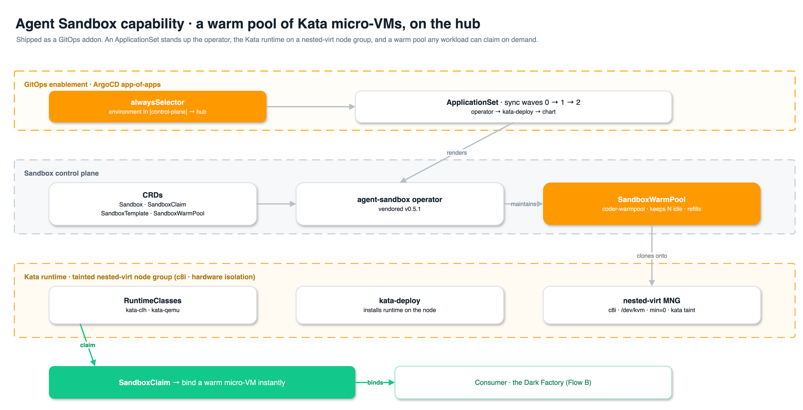
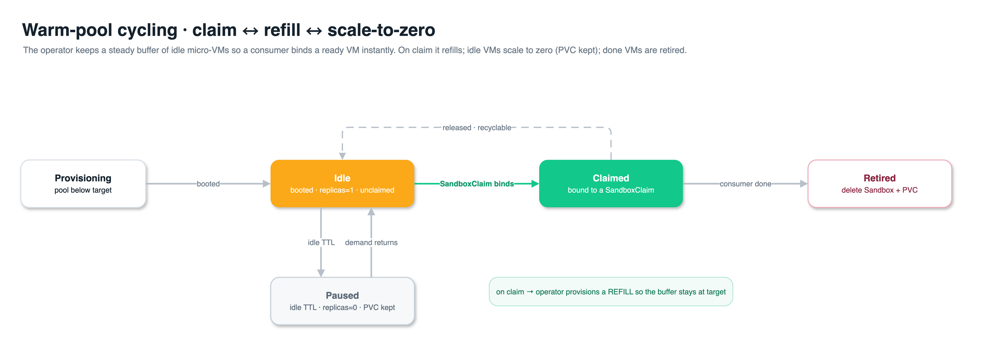

# Flow A — Agent Sandbox Capability (permanent platform feature)

The **Agent Sandbox** capability ships as a first-class agent-platform GitOps addon. When the
platform is deployed, it stands up the Kata (Cloud Hypervisor) micro-VM runtime on a dedicated
nested-virt node group, the `Sandbox` CRD + operator, and a **warm pool** of pre-provisioned,
hardware-isolated sandboxes kept ready by the operator's native `SandboxWarmPool`. This is
independent of the Dark Factory — it is the reusable isolation substrate any agent workload can
claim.

> **Hosted on the hub cluster** — the build/author plane, co-located with Argo Workflows so Flow B
> orchestrates the pool single-cluster. Because the hub runs EKS Auto Mode (which can't host Kata)
> and the fleet control plane (Keycloak/ArgoCD/external-secrets), the capability requires a
> **dedicated tainted nested-virt node group** and **control-plane egress isolation** — see
> [README §3](../README.md#3-flow-a--agent-sandbox-capability-permanent-platform-feature) and
> [§10](../README.md#10-security-model).

> 🎨 Diagrams are editable draw.io — sources in [`src/`](./src/), rendered PNGs in [`img/`](./img/).

---

## A.1 — Capability architecture

Shipped as a GitOps addon: an ApplicationSet renders the operator, the Kata runtime on a nested-virt
node group, and a warm pool that any workload (notably the Dark Factory) claims on demand.

*Edit: [`src/flow-a-capability.drawio`](./src/flow-a-capability.drawio)*

---

## A.2 — Warm-pool cycling (claim ↔ refill ↔ scale-to-zero)

The operator keeps a steady buffer of idle sandboxes so a consumer binds a **ready** VM instantly
instead of paying cold-start. Idle sandboxes use the `Sandbox` `replicas: 0/1` **scale subresource**,
so "idle" is cheap; on claim the operator provisions a refill to keep the buffer at target.

*Edit: [`src/flow-a-warmpool.drawio`](./src/flow-a-warmpool.drawio)*
