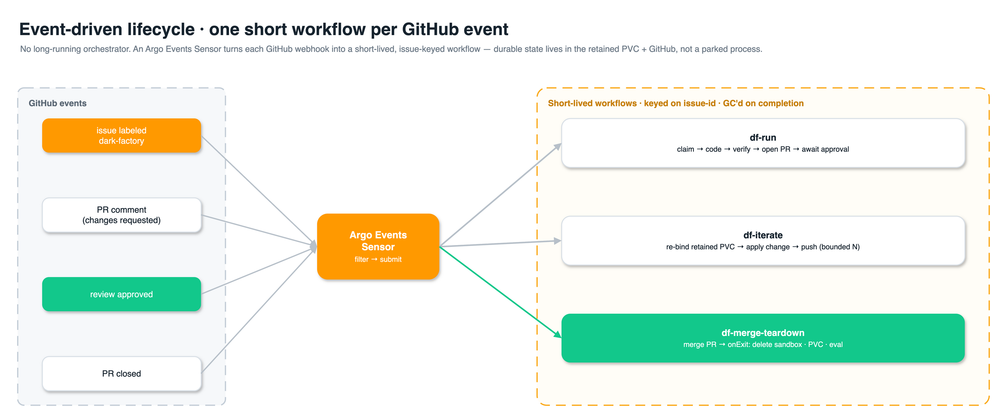
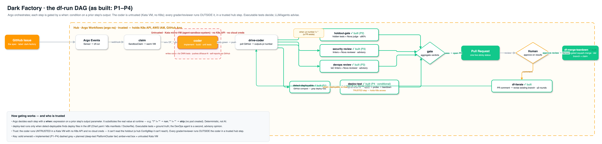

# Flow B — Dark Factory (issue → PR → merge → teardown)

A GitHub issue is a **spec**. On the **hub cluster**, **Argo Workflows** claims a warm Kata sandbox,
a pluggable coding assistant implements + tests the change and pushes a branch, the workflow opens a
PR and runs independent verification (holdout gate + AWS Security/DevOps review), a human approves on
**results**, and everything is torn down on merge. Autonomy **Level 3**: the human's only job is to
approve the merge.

> **Runs on the hub** — the build/author plane, co-located with Argo Workflows and the Flow A warm
> pool. Single-cluster orchestration: the workflow watches the coder pod and eval Job directly. See
> [README §2](../README.md#2-two-flows-at-a-glance) for *why the hub, not a spoke*, and
> [§10](../README.md#10-security-model) for the control-plane isolation that makes it safe.

> 🎨 Diagrams are editable draw.io — sources in [`src/`](./src/), rendered PNGs in [`img/`](./img/).

---

## B.1 — End-to-end lifecycle

Issue → claim a warm micro-VM → coder implements + tests → verify → open PR with a live sticky
status → human approves on results → merge + teardown. A bounded feedback loop routes review
comments back to the coder.


*Edit: [`src/flow-b-lifecycle.drawio`](./src/flow-b-lifecycle.drawio)*

---

## B.2 — Hub topology & three-layer isolation

The Dark Factory shares a cluster with the fleet control plane, so untrusted coder VMs are fenced
off by **three independent, verified layers** — a standard NetworkPolicy (pod-IP egress), an
Admin-tier ClusterNetworkPolicy (applies to the Sandbox-CR-owned coder pods), and a ClusterIP
node-firewall (closes the EKS VPC-CNI DNAT gap). Net result: the coder reaches only DNS, Bifrost,
and public GitHub — never the control plane, node, or API server.


*Edit: [`src/flow-b-hub-topology.drawio`](./src/flow-b-hub-topology.drawio)*

---

## B.3 — Event-driven lifecycle

No long-running orchestrator. An **Argo Events Sensor** turns each GitHub webhook into a short-lived,
issue-keyed workflow (`df-run`, `df-iterate`, `df-merge-teardown`); durable state lives in the
retained workspace PVC + GitHub, not a parked process.



*Edit: [`src/flow-b-lifecycle-events.drawio`](./src/flow-b-lifecycle-events.drawio)*

---

## B.4 — The `df-run` DAG (as built) & how step-gating works

This is the **implemented** pipeline (P1 + P2 holdout + P3 Security/DevOps reviewers, all solid
emerald), with the P4 `deploy-test` steps drawn dashed so the target shape is legible. It answers the
two questions the higher-level diagrams don't: **where each step runs** (trust boundary) and **how
Argo decides whether a step runs** (the `when:` gate).



*Edit: [`src/flow-b-df-run-dag.drawio`](./src/flow-b-df-run-dag.drawio)*

**How a step is gated — `when:` on a prior step's output.** Argo is a declarative orchestrator, not
an agent: it does not "improvise" steps. Every task is *defined* in the DAG, and each carries an
optional `when:` expression that Argo evaluates at runtime against a value an earlier step emitted.
The `holdout-gate` step already does this:

```yaml
- name: holdout-gate
  dependencies: [drive-coder]
  when: "{{tasks.drive-coder.outputs.parameters.pr-number}} != \"\""   # run only if a PR exists
```

`drive-coder` writes the PR number to a file → Argo captures it as an output parameter → Argo
substitutes the real value into the `when:` string (`"7" != ""` → **run**; `"" != ""` → **skip**,
no pod is created). Deterministic, file/value-based — no AI in the decision.

**Conditional deploy-test (P4) uses the same mechanism, keyed on the diff.** A cheap `detect-deployable`
step runs `git diff --name-only` and greps for deployable files (`Chart.yaml`, `k8s/`, `deployment.yaml`,
`Dockerfile`); it emits `deployable = true|false`; `deploy-test` is gated `when: deployable == true`.
So "the PR touched a Deployment manifest → deploy-test runs; it only touched app code → skip."

**Two levels of testing, two homes (the trust boundary):**

| Test level | What it checks | Where it runs | K8s access |
|---|---|---|---|
| **Unit / build** | compiles, `subtract(5,3)==2`, `npm test`/`go test` green | inside the **coder** (Kata VM) + re-run by **holdout-gate** | **none** (correct — the VM is untrusted) |
| **Deploy / integration** (P4) | deploys to an ephemeral namespace, endpoint returns 200, pod healthy | a **trusted hub step** (`deploy-test`), never the VM | **yes** — held by the workflow SA, never the coder |

**Executable tests decide; LLM/agents advise.** The holdout's hidden tests are the ground truth (a
stub can't pass a real test); the Nova judge is a *reviewer* that catches gaming the tests can't see
(hard-coded inputs, `return true`). The **P3 Security/DevOps reviewers** are the same shape — their
deterministic linters (secret scan, `npm audit`; Dockerfile/k8s hygiene) are the hard signal and the
Nova reviewer is the advisory second opinion; both are read-only on the diff and post
`dark-factory/{security,devops}` statuses (advisory in v1). For deploy-work, the `deploy-test`
executable probes will be ground truth and the DevOps agent the advisory second opinion.

---

## B.5 — The one sticky PR comment

The workflow maintains **one** comment, edited in place via a hidden marker — no comment spam. Until
tests are green there is no PR, so pre-PR status lives on the **issue**; from PR-open onward the
comment is the canonical board. Parallel review steps are serialized by a per-issue mutex.

```
## 🏭 Dark Factory — issue #42  ·  PR #128
✅ Claimed sandbox (hub)            12:01
✅ Branch df/issue-42               12:01
✅ Implement                        12:04
✅ Build + unit tests               12:07   📄 log
✅ PR opened  #128                  12:07
⏳ Security review…
⬜ DevOps review
⬜ Holdout gate (0/12)
⬜ Ready for review
```

Each stage links to raw logs / the Argo run / the Langfuse trace (**verifiability-by-citation**).
The PR **body** carries the final report: what changed, test results, holdout satisfaction %, and
the Security/DevOps findings.
